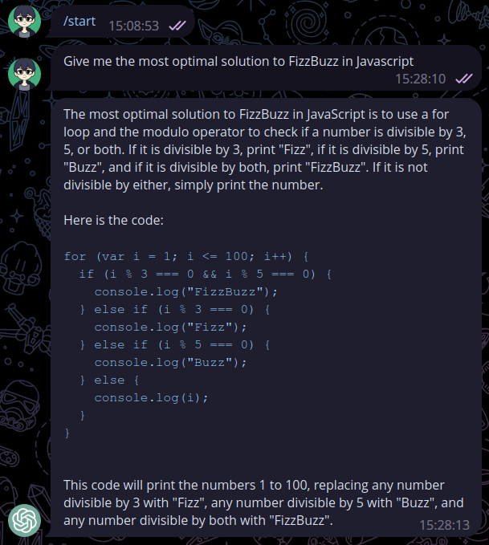
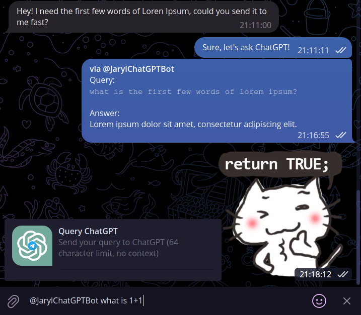

# cf-workers-chatgpt-telegram-bot


## Description
 

Serverless Telegram bot in webhook mode to quickly interface with 
* [OpenAI's Chat Completion API](https://platform.openai.com/docs/guides/chat)
* [Azure OpenAI's Chat Completion API](https://learn.microsoft.com/en-us/azure/cognitive-services/openai/chatgpt-quickstart?tabs=command-line&pivots=rest-api#retrieve-key-and-endpoint)

This bot supports private chats, group chats and inline mode (tagging the bot in any chat with a query) with a confirmation button so as you don't consume tokens live.

Notes:
- Inline mode has been developed deliberately to not support using context KV even though it should technically be possible
- Inline mode is capped at a 64-character limit because of `callback_data` limits, but it can be solved by saving the query in KV if required
- This is mainly for personal use, if you would like to add features, do fork the repository. Do perform PRs back if you would be so kind!

## Prerequisites
- A Cloudflare account with Workers (at least free-tier) enabled
- The Telegram bot token of a bot created on Telegram via [@BotFather](https://t.me/BotFather)
- An OpenAI/Azure OpenAI API key that has the ability to use the Chat Completion API

## Getting Started
### Wrangler
1. Clone this repository
2. Run `npm ci` or `yarn install`
3. Run `npx wrangler secret put TELEGRAM_BOT_TOKEN` and set the Telegram bot token
4. Set API service type var `SERVICE_TYPE` in wrangler.toml
    - OpenAI: `SERVICE_TYPE = 1`
    - Azure OpenAI: `SERVICE_TYPE = 2`
5. Set API Key
    - OpenAI: run `npx wrangler secret put OAI_API_KEY` or set `OAI_API_KEY = "<api-key>"` in wrangler.toml
    - Azure OpenAI: `npx wrangler secret put AOAI_API_KEY` or set `AOAI_API_KEY = "<api-key>"` in wrangler.toml
6. Set model and endpoint in wrangler.toml
    - OpenAI: 
        - (Optional) `OAI_CHATGPT_MODEL = "<model-name>"`, ref [doc](https://platform.openai.com/docs/api-reference/chat/create#chat/create-model)
    - Azure OpenAI:
        - `AOAI_RESOURCE_NAME = "<resource-name>"`
        - `AOAI_DEPLOYMENT_NAME = "<deployment-name>"`
        - `AOAI_API_VERSION = "<api-version>"`
7. Add space-delimited case-sensitive usernames to whitelist in `TELEGRAM_USERNAME_WHITELIST` in wrangler.toml
8. (Optional) To allow extra lines of context, run `npx wrangler kv:namespace create context` and replace the ID of `CHATGPT_TELEGRAM_BOT_KV` and increase `CONTEXT` to more than 0 in wrangler.toml (will consume a lot more tokens), else remove `kv_namespaces` block entirely from wrangler.toml
9. (Optional) To include a `system` message to set the AI's behavior, update `CHATGPT_BEHAVIOR` in wrangler.toml
10. Run `npx wrangler publish` to deploy to Cloudflare Workers
11. (Optional) Enable `Inline Mode` for the bot on BotFather to allow inline query flow
12. Replace `{TELEGRAM_BOT_TOKEN}` and `{WORKERS_NAMESPACE}` on the following `https://api.telegram.org/bot{TELEGRAM_BOT_TOKEN}/setWebhook?&allowed_updates=%5B%22message%22%2C%22inline_query%22%2C%22callback_query%22%5D&url=https%3A%2F%2Fcf-workers-chatgpt-telegram-bot.{WORKERS_NAMESPACE}.workers.dev%2F{TELEGRAM_BOT_TOKEN}` and access it on your browser

## Other Optional Steps
### Commands list (for BotFather as well)
```
chatgpt - Triggers use of the bot in group chats without toggling Private Mode
context - Shows stored context for the current chat
clear - Clears the stored context for the current chat and any ForceReply messages
```
